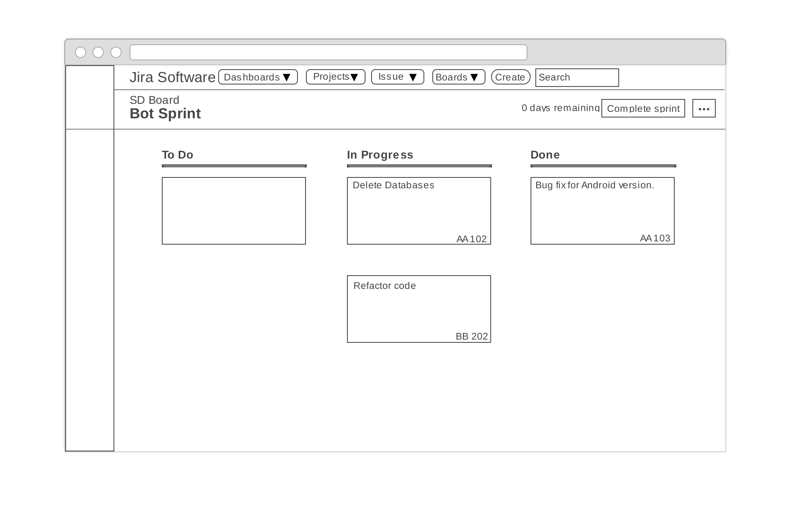
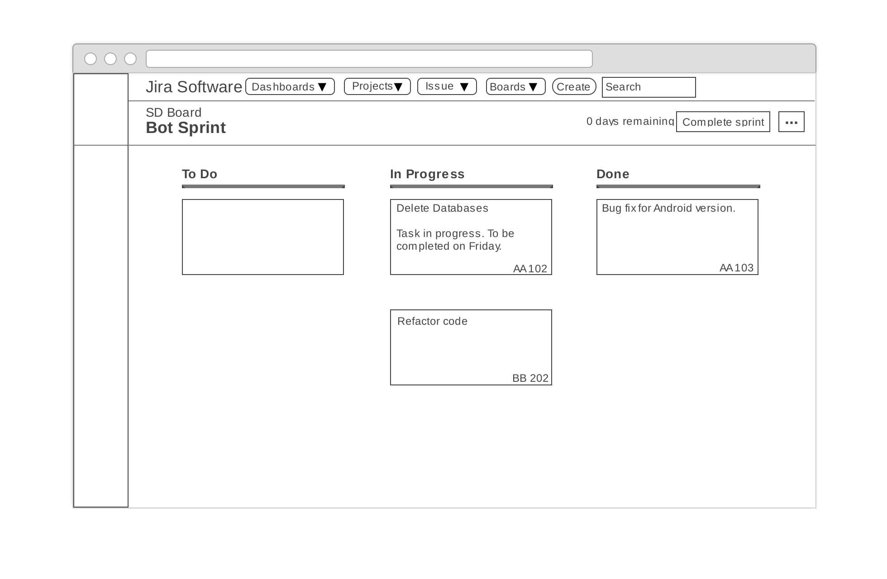
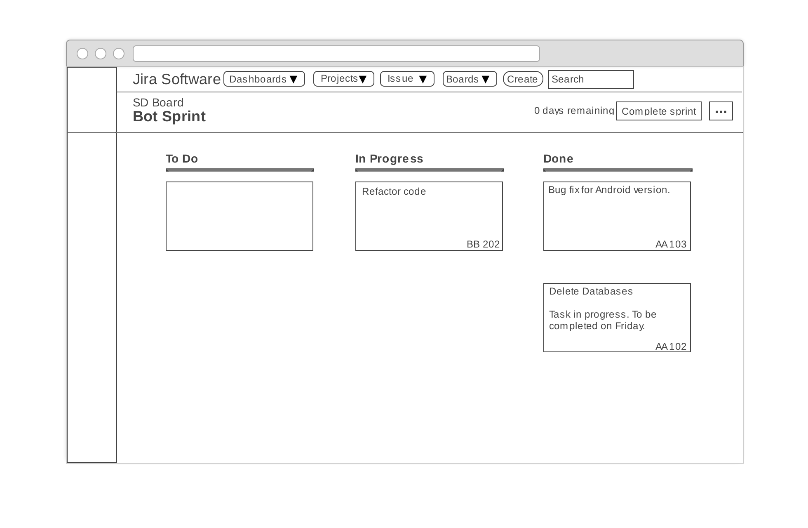
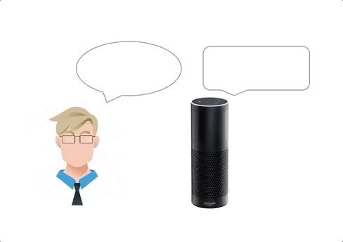
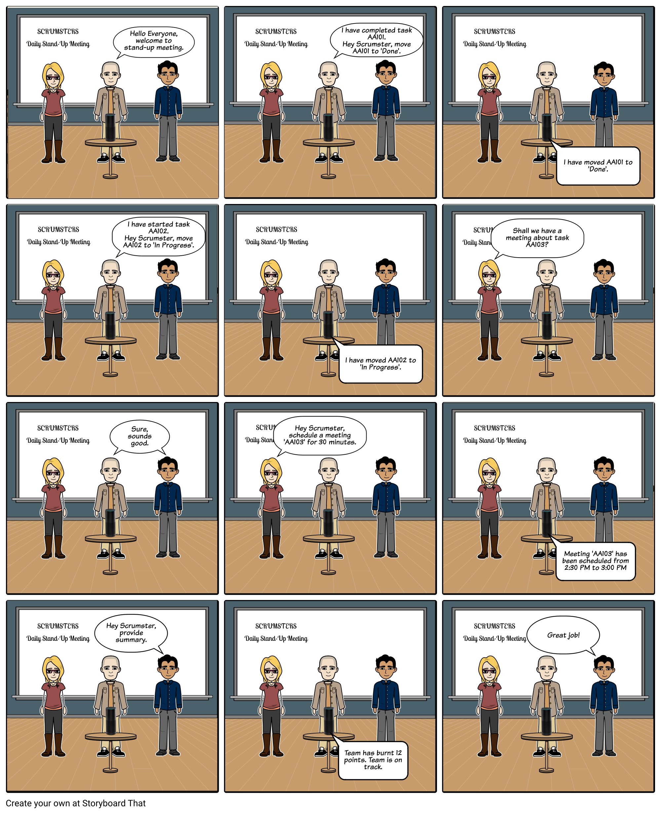
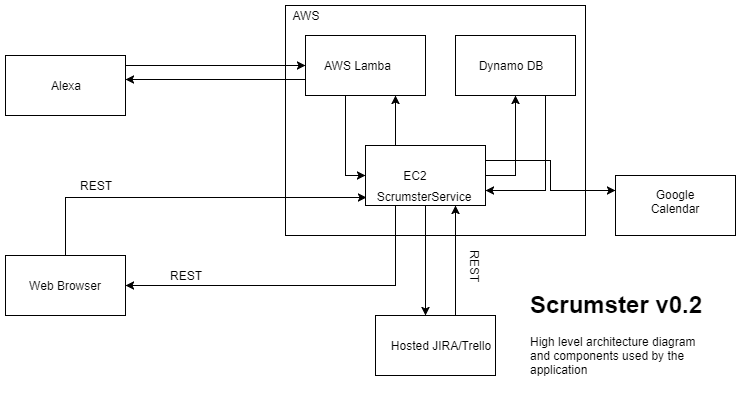

## DESIGN MILESTONE

## Problem Statement

Scrum is a subset of the Agile methodology in software development and it is extensively used today in organizations, big and small. It is known to increase productivity and it modularizes development in cycles of work called Sprints. A Sprint is usually 2-4 weeks long and is conducted using tools such as JIRA or Trello. As a part of scrum, the team conducts daily meetings called "stand-ups" to take updates from team members, and the scrum master conducts and manages these meetings throughout the course of the sprint. There are 3 roles as part of Scrum - Product Owner, Team and Scrum Master. The scrum master acts as the advocate for Scrum, and helps the team learn and apply Scrum to achieve business value. 

Since a lot of meetings take place in Scrum and there are multiple teams within an organization, a lot of manual time and effort goes into this process. The organization also has to invest in hiring and training a professional scrum master. We believe that this is a problem worth solving and we intend to solve it by developing a bot named 'Scrumster' that will be perform some of the tasks necessary to co-ordinate and manage a Scrum team. Many of the tasks will be automated such as updating tasks on the JIRA board or collecting updates from engineers, making the Scrum process much more effective and easier to adopt. Any attempt to ease the adoption of Scrum is something worth pursuing as many organizations find the transition to Scrum a cumbersome task. With this bot, the effort put in by the scrum master as well as the team members will be significantly reduced and the Scrum process will be much more streamlined.

## Bot Description

Scrumster is a bot designed to serve as an advocate of Scrum. The end goal would be to replace one of the existing Scrum roles (scrum master in particular), but at the level of implemetation we are focusing on, we would want the bot to be a catalyst for the overall Scrum process within teams in an organization. Most of us who have experience working in Scrum teams find updating Kanban boards to be a laborious task. Scrumster looks to aid in the process of updating tasks by having a simple voice interaction, through an Alexa application, with engineers during a stand-up to update tasks pertaining to a sprint. At the back end, it is tied to JIRA/Trello APIs to acheive this task. Scrumster aims to provide the following functionality:

* Assist in moving tasks from one state to another (for eg. from 'In-Progess' to 'Done'). 
* Schedule meetings for a duration of 30 minutes or 1 hour when all team members are available. This is achieved by accessing their calendars via the Google Calendar API.
* Summarize the sprint up to that point and provide feedback as to whether the sprint is on track or not. 

### Description of how/when/where Alexa is used in the Bot

The Scrumster bot would be used during a stand-up meeting and will make use of Alexa as a medium for verbal interaction with the team members. Initially the team member would have to trigger the application using a key-phrase such as "Hey Scrumster, this is xyz", at which point of time the bot (Assuming that it is already configured for a particular Scrum team) user(s) will start giving updates about their tasks and give instructions to the Scrumster to change the tasks from one state to another. Bot will decipher the movements to be made on the JIRA/Trello dashboards by recognizing the task IDs. Once all tasks that need to be moved are covered by the team, user shall send out a speech instruction to Alexa saying "end the meeting", and Alexa would collect data from the JIRA/Trello board. Alexa will be used at the end of the meeting to give a summary of meeting and feeback on the team's performance. Once all tasks have been updated for a specific team member, Alexa's state is reset and the next team member would start off again with the trigger. Alexa would also be able to schedule the team meeting if requested by the user. 

Alexa would be integrated with AWS Lambda functions to process voice input and convert it into data which would serve as input to the JIRA/Trello APIs.  

## Use Cases

1. Use Case - 1
  
  ```
  
Use Case: Move tasks from one state to another as per user input.
1 Preconditions
     User must have access to the Scumster Bot and his/her name must be listed as members of the JIRA Scrum team. The Scrum has to be triggered to be started, user will do this by using a key phrase like "Hey Scrumster". 
2 Main Flow
     After the user starts the Scrumster, the users can give instructions to Scrumster Bot [S1] to move tasks by mentioning the task ID that will be recognized by the Bot[S2]. The user can ask Scrumster to move from any of the valid states. Example - user says "Move task AT-10 to 'Done'/'Completed' column. 
     
3 Subflows
    [S1] User gives Bot instructions to move tasks by calling out task IDs.
    [S2] Bot will move the tasks by recognizing the task ID.
4 Alternative Flows
    [E1] No tasks make transition from one state to the other in the collected updates.
  
  ```
  
2. Use Case - 2

```
Use Case: Sprint Summary and Feedback 
1 Preconditions
   Scrumster Bot should have finished with all the team members' updates. 
2 Main Flow
   At the end of the stand-up meeting, one of the users will use a key-phrase such as "Scrumster, End the meeting" to indicate that the team has finished giving updates and tasks are done moving[S1]. Scrum Bot will analyze the Scrum Board and talk about the progress of the team[S2]. Bot will review performance of the team and comment on current progress v/s previous sprint performance[S3]. 
3 Subflows
  [S1] Bot gets input from user to end the current meeting.
  [S2] Bot will analyze the Scrum board(JIRA/Trello) for tracking the team's overall progress.
  [S3] Talk about overall performance of the team and comparison with past sprint performance.
  
```

3. Use Case - 3

```
Use Case: Schedule a meeting for the team.
1 Preconditions
   All users must have access to Scrum Board.    
2 Main Flow
   One of the users gives speech instruction to Scrumster Bot to schedule a meeting indicating the duration of meeting (we will support only 30mins/1hour meeting slots) [S1]. This will be done for the entire team. Bot checks the calendars of all the team members and schedule a team meeting [S2]. Sends out a notification about the meeting timings [S3]. If no timings match for all the team members, Bot will notify that meeting cannot be scheduled [E1].
3 Subflows
  [S1] User asks Scrumster to schedule a team meeting.
  [S2] Bot checks calendars of all the team members.
  [S3] Bot gives back an update to team mentioning the meeting slot.
 
4 Alternative Flows
  [E1] No timings matching for team members.
```


## Design Sketches

__Wireframes__  
We have created a wireframe mockup showing the result of adding a note to an existing task and moving a task from 'In Progress' to 'Done'.

* This is the initial state of the Agile board.


* We will now see the results for two different requests.
   * A user request to Scrumster to add a note to a task.
   
   
   * A user request to Scrumster to move a task from 'In Progress' to 'Done'.
   
  
To provide an idea of how these requests are made, we show a simulation of a sample conversation of a user with Scrumster via Alexa (the GIF is approximately 11 seconds long. Please do not assume there is an issue if you do not see any change for a few seconds).



__Storyboard__  
Our storyboard is a sequence of illustrations that provide an understanding of how our bot, Scrumster, will take voice inputs from the user via Alexa and make changes to a JIRA Agile board. We have provided two scenarios.
1. A user providing an update to an exisiting task.
2. A user moving a task from 'In Progress' to 'Done'.




## Architecture Design


The Architecture consists of essentially 4 components. The Alexa application or a simulator, which can be invoked using Lambda functions that Amazon provides, a central platform hosted on a cloud provider like AWS which would be developed to act as the repository for all the activties that Scrumster carries out, and a hosted JIRA/Trello service, Google calendar service. Alexa would not be used for all the human interactions, but only to move the tasks on the board, schedule team meeting during the day, provide summary. 

The Alexa application acts as the interaction medium between Human and bot , to collect the voice input from the Engineer and give voice feedback regarding the Scrum. The Central platfrom hosted on AWS would be linked to both the Alexa application and the JIRA page. Its main purpose is to queue the requests being made to JIRA, to run as a background task to contain the latency experienced at the Alexa voice interface. This reduction in latency would ensure a better User Experience, thereby making the 'stand-up' portion of the functionality more real-time. The central platform can also be used to provide a dashboard for statistics, which would be made available to the person monitoring Scrum progress. The Central platform will also provide integration with Google calendar, this would allow Alexa to schedule team meetings. 

A hosted JIRA/Trello service is used, as opposed to setting up a server and maintaining it ourselves. This is a design option made to simplify infrastructure maintanence and focus on realizing Bot functionality. The requests made at the Alexa application would translate into JIRA/Trello API calls to realize functionality as defined by our use cases.

__Design Patterns__
* **Event driven programming**: A programming paradaign where flow of programs is determined by the events. In our application, the user starts the Scrumster service and issues a request when prompted by the service. To achieve this efficiently we are using AWS Lambda which is a event driven serverless computing platform provided by Amazon.

```javascript
'use strict';

const Alexa = require('alexa-sdk');

const APP_ID = '';  
const HELP_MESSAGE = 'Welcome to Scrumster help';
const STOP_MESSAGE = 'Thanks for using Scrumster';

const handlers = {
    'LaunchRequest': function () {
        this.emit('Start');
    },

    'Start': function () {

        // Create speech output
        this.emit(':tellWithCard', speechOutput, 'Welcome,', 'Scrumster has started');
    },
    'AMAZON.HelpIntent': function () {
        const speechOutput = this.t('HELP_MESSAGE');
        const reprompt = this.t('HELP_MESSAGE');
        this.emit(':ask', speechOutput, reprompt);
    },
    'AMAZON.CancelIntent': function () {
        this.emit(':tell', this.t('STOP_MESSAGE'));
    },
    'AMAZON.StopIntent': function () {
        this.emit(':tell', this.t('STOP_MESSAGE'));
    },
};

exports.handler = function (event, context) {
    const alexa = Alexa.handler(event, context);
    alexa.APP_ID = APP_ID;
    // To enable string internationalization (i18n) features, set a resources object.
    alexa.registerHandlers(handlers);
    alexa.execute();
};
```
The above code is the AWS Lambda function for the Scrumster service (an Amazon Alexa skill). The application executes the 'Start' function at launch, achieved by calling Alexa via voice. This is a skeleton structure that will be updated with additional functions.

* **REST API**: We are integrating the Scrumster service (Amazon Alexa skill) with JIRA API allowing users to make requests by invoking the Scrumster service using Amazon Alexa.

__Constraints or Guidlines__
* **User identification**: Restriction in Amazon Alexa functionality prevents a user voice from being identified uniquely. This forces users to provide unique identification.
* **No trace**: Due to lack of user identification, users are able to make modifications to other users tasks without any trace.
